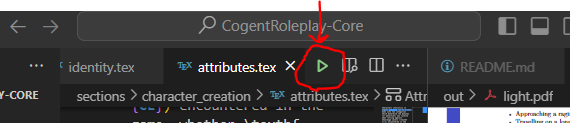
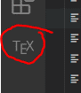
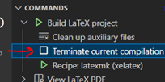

# Writing in $\LaTeX$ for the Cogent Roleplay Rulebook

## Installing LaTeX and setting up VSCode
[Follow this guide](https://blog.jakelee.co.uk/getting-latex-working-in-vscode-on-windows/) to install LaTeX and set it up for VSCode. 
> [!IMPORTANT] 
> Install the full scheme or the medium scheme instead of LaTeX only, otherwise you’ll have issues with missing packages. It is possible to install these packages using TLShell TeX Live Manager but it’s much easier during inital installation.

## Building the PDFs
The PDF will build automatically upon saving, or alteratively you can click the green arrow next to the file ribbon:


The PDF output can be found as `light.pdf` in the `./out` folder. This can be viewed directily inside VSCode after the LaTeX extension is installed.

### Failed builds
If the PDF does not build successfully (either you get an error or the build message stays showing at the bottom) there are steps to take to track the issue. By showing the terminal (view menu, tick terminal) and then selecting LaTeX compliler under the right hand drop down, you can see the pdf compile output. Generally if there’s an issue it will be seen at the very bottom of the output. Often it’s a syntax error or a missing package on your install. 

### Stopping compilation
To stop the compilation click of the TEX extension button and then click Terminate current compilation. You may have to double click. 




Latex-Workshop should delete the ./out folder once you terminate the build. If it does not, before recompiling you should delete this directory. This is as sometimes a failed compilation leaves half-finished files in this folder that then cause any subsequent compiles to fail.

### Missing packages
If you are missing a package, open the program "TLShell TeX Live Manager" that will have been installed with LaTeX. Here you can search for packages, select them and then install them. VSCode will need to be restarted before LaTeX will find them.  

## Project structure
All of the content files are found under sections. Each section (or part as LaTeX calls them) of the rulebook has a separate folder under this folder. Examples are introduction and character_creation. Within these sections each chapter has its own `.tex` file. It is within these files that the content of the pages lies. The only other important file is main.tex in the root directory. This file is responsible for collating all the sections and chapters. Within it you can see the links to the chapter `.tex` files. 

## LaTeX formatting
You’ll often see `\label{this_is_my_label_name}` in the following examples. These labels allow you to reference within the text using `\ref{this_is_my_label_name}`. In most cases they are not necessary but adding them is a good idea for later. The wording of these labels can be anything, but for easy organization we use things like `sec:` and `fig:` to sort our labels.

### Creating a new book section (part)
Use `/part{This is the part title}` within main.tex.

### Creating a new chapter
Within `main.tex` add a new block to link the chapter. This will look like:

```latex
\newpage
\chapter{This is a chapter title} \label{ch:XX_this_is_a_chapter_title}
\input{sections/part/this_is_the_file_path}
```
Where `XX` is the chapter name abbreviated to two letters.
 
Now just create a new .tex file at the right path, and it will appear in the final document.

### Text within .tex files
You can just type plain text into your chapter file and it will be added to the document. For bold text you must use `\textbf{This is my bold text}` rather than the double ** as in markdown. For italic text use `\textit{___}`.

> [!IMPORTANT]
> Do not use “&” alone in text. This will cause errors. Always type “\&”. The slash will not show in the final file. In order to get a new line you need to leave an empty line between the paragraphs. A single enter will not do it.

### Sections within Chapters
Adding a section is also very easy. Just use 
```latex 
\section{Section Titles are So Cool} \label{sec:section_titles_are_so_cool}
```

### Subsections within Sections
Add a subsection as follows:
```latex
\subsection{Subsection Time!} \label{subsec:subsection_time}
```

### Bulleted List
```latex
\begin{itemize}
    \item This is the first bullet point.
    \item Now the second.
    \item And the third.
\end{itemize}
```
### Numbered List
```latex
\begin{enumerate}
    \item This is the first bullet point.
    \item Now the second.
    \item And the third.
\end{enumerate}
```
 
### Indenting Text
To indent text we’ll use the following code:
```latex
\begin{displayquote}
	This is our indented text. We can do all sorts in here.
	
    We can have new lines!

    \textbf{Even Bold Text!} Endless possibility.
\end{displayquote}
```

### Tables in LaTeX
Tables in latex are unfortunatly a bit awkward. Here’s a template though!

```latex
\begin{center}
    \begin{tabular}{|l|c c|} 
      \hline
      First Column & Column Title 2 & Distance \\ 
      \hline
      This is a row & Another cell & 30m \\ 
      Another row & Another cell & 20m \\
      A final row & A penultimate cell & A final cell\\
      \hline
    \end{tabular}
\end{center}
```
 
The text in the curly brackets after `\begin{tabular}` set the tables vertical lines and horizontal text alignment. A `l` gives left-alignment, a `r` right and a `c` centered. If two columns are separated by a `|` then a vertical line is drawn. If two columns are separated by a space then no line separated the columns. To create horizontal lines on our table we must use `\hline` within the table. For each row we add a line that has each cells contents separated by `&` and then finished with a double slash `\\`. More is possible than this but it is a good starting point.

### Comments in LaTeX
Comments in LaTeX are created using the `%` character as below:
```latex
%This is a comment
Some text in \textbf{bold}. %This is also a comment
```

### Images in Latex
Below is a simple way to import a picture to the document.

```latex
\begin{figure}[H]
    \includegraphics[width=8cm]{images/path_to_image}
    \centering
    %\caption{This could be a caption. Remove the % if so!}
\end{figure}
```


